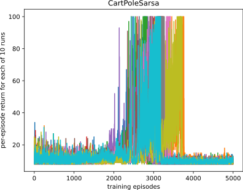
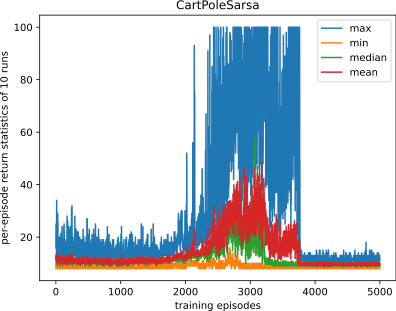
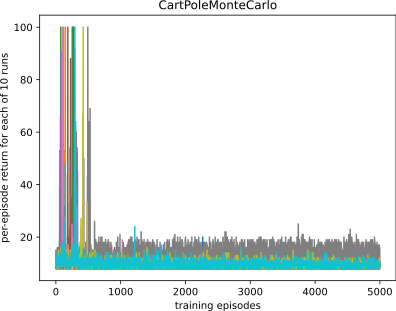
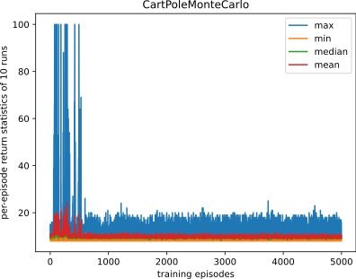
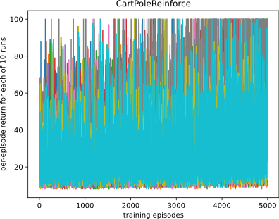
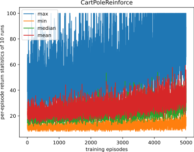

# My Observations and Comments

## 1. SARSA with state-value function approximation

- SARSA started to learn, but after some episodes the agent forgot all his learned knowledge. Decreasing alpha for slower, but more stable learning did not help. 
- I further tried to start with a high $\epsilon$ , so the agent explores a lot at the beginning in combination with a relative small value for the `anneal epsilon`function to decrease $\epsilon$, so the agent stabilzes. But this did not help either. 

## 2. Monte Carlo with state-value function
- Since the Monte Carlo algorithm was not learning anything, I kept increasing $\alpha$. Since this did not help, I can only assume that there are erros inside my code or the algorithm is not a good fit for the Cart Pole env.

## 3. REINFORCE with soft-max policy
- the Reinforce performed the best for the given challenge. But it should be mentioned that the computing the results took by far the longest compared to Monte Carlo and SARSA. 
- Also, Reinforce seems to be the most stable algorithm. It seems to be converging, but to make a meaningful statement, I would need to increase the number of episodes. Due to the high computation costs I could not afford to further increase the value, why I limited it to 5000 episodes.

## 4. REINFORCE with baseline and soft-max policy

Sadly I could not get the REINFORCE algorithm with Baseline to work. :( 